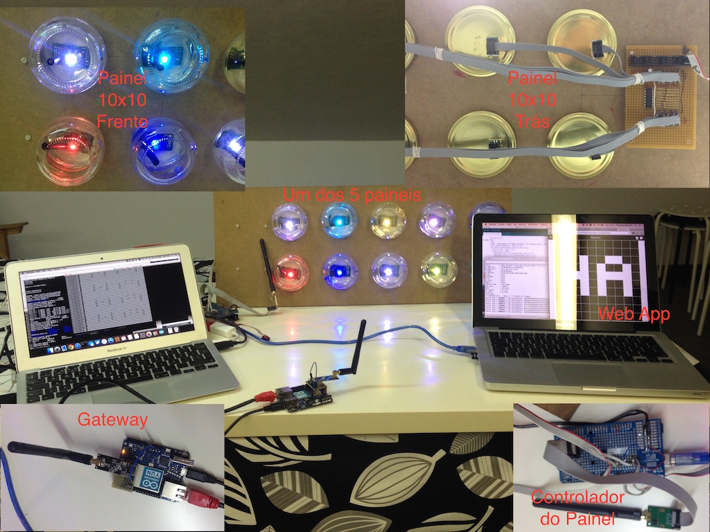
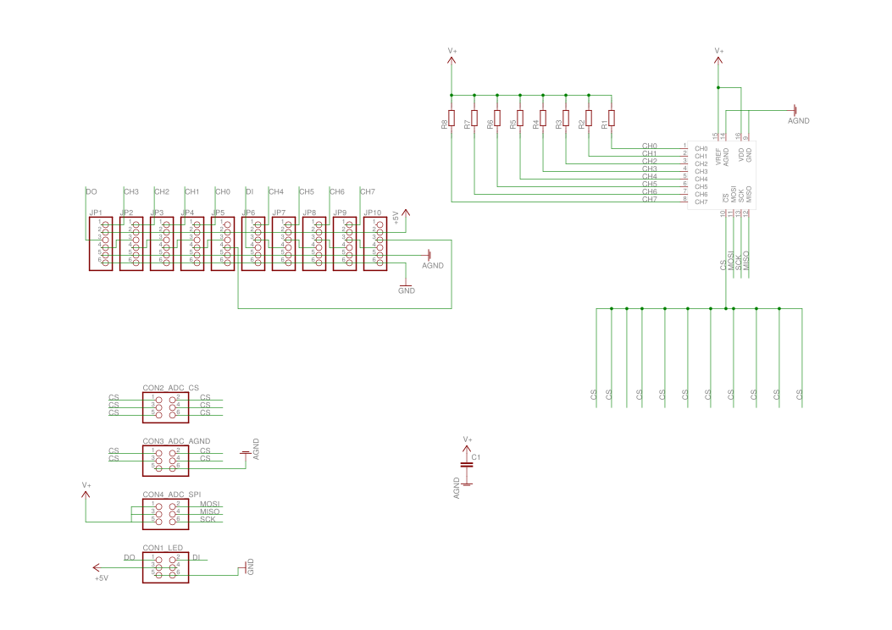
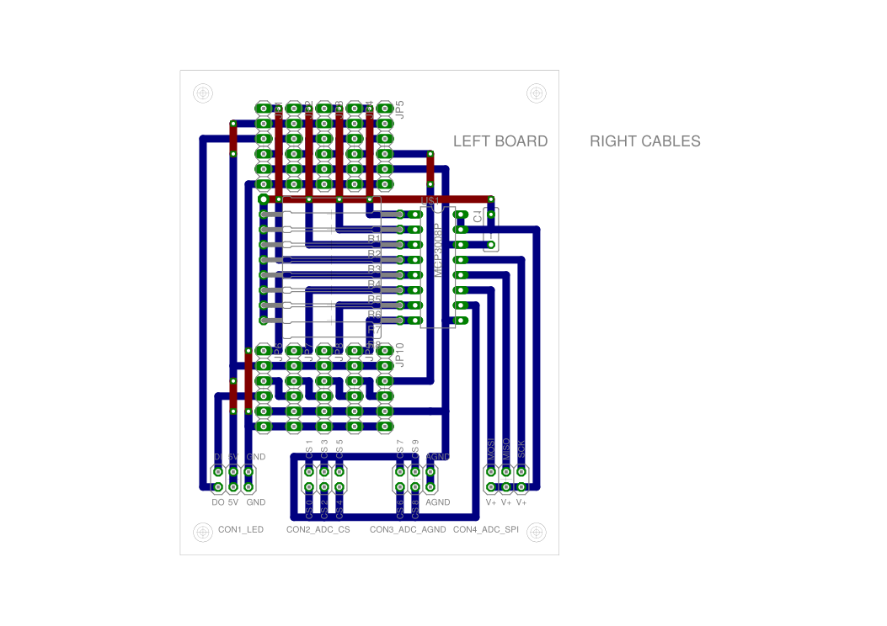
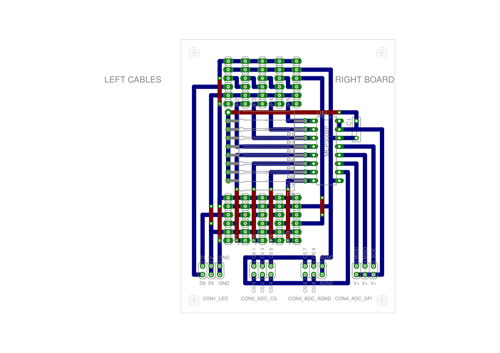
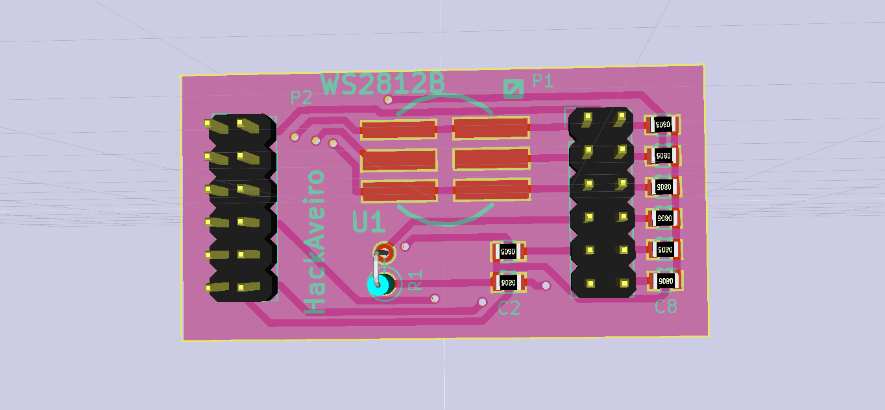
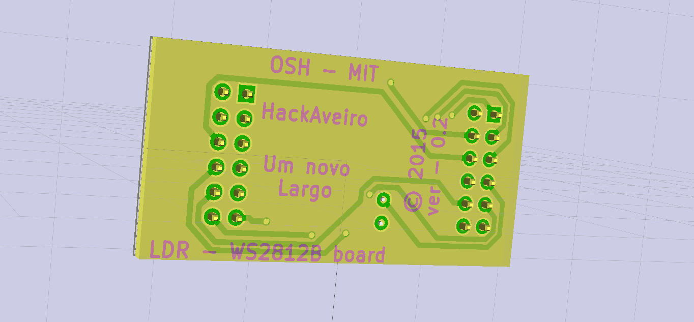

Interactive LED wall
====================
This project is being developed to be installed in a public space in Aveiro that was recovered by a wide group of public and citizens entities. [vivacidade.umnovolargo.pt!](http://vivacidade.umnovolargo.pt)  
The interactive wall has 100 LEDs mounted in jam jars ! Each bottle has an RGB LED ( Neopixel ) and LDR sensor for users to physically interact with the wall. The panel is controlled by an Arduino which uses a radio link to communicate with a gateway situated a few hundred meters away and connects the system to the Internet. Because the place has no available electricity or Internet access it's powered by solar panels.  
Users can interact with the system through the Web App: [vivacidade-ledmatrixcontroller!](https://github.com/HackAveiro/vivacidade-ledmatrixcontroller)

Prototype images
===================

GIT Structure
=============

[ADC_BOARD!](ADC_Board)
===========
The system have 10 of this boards to connect all the 100 LED. The ADC board also have ADC chips that convert the LDR light sensors readings. The ADC chips are connected to the Arduino main board via a SPI bus.

PCB Schematic (Left Board)

PCB Layout ( (Left Board)

PCB Schematic (Left Board)

PCB Layout ( (Left Board)

[Gateway_Vivacidade!](Gateway_Vivacidade)
==================
[]https://github.com/HackAveiro/vivacidade/tree/master/Gateway_Vivacidade

[led_board!](led_board)
=========

Arduino dependencies
====================
* MCP3008 - https://github.com/nodesign/MCP3008
* RF24 - https://github.com/maniacbug/RF24.git
* FastLED - https://github.com/FastLED/FastLED
